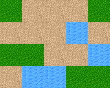
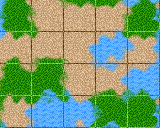
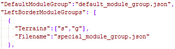
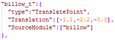

# Wangscape [](https://travis-ci.org/Wangscape/Wangscape) [](https://ci.appveyor.com/project/serin-delaunay/wangscape) [](https://gitter.im/Wangscape/Lobby)

Converts terrain tiles to procedural corner Wang tilesets.


Procjam 2016 project (in progress)

# What is Wangscape for?
Does your game have nice square terrain tiles like these ones by David Gervais? ([CC BY 3.0](https://creativecommons.org/licenses/by/3.0/))


Do they make sharp borders and ugly right angles like these when you combine them into a map?



Would you prefer to have smooth transitions and curved boundaries like these in your map display?


Do you want meandering borders that affect both sides of the logical tile boundaries?



Do you think the above tiles need some adjustment before they look right?




Do you want to reduce visual repetition by making duplicate border tiles that still tessellate seamlessly? Do you want to do all of this automatically using just the base tile images and a few JSON configuration files?

Then Wangscape can help.

# What are corner Wang tiles?

A good explanation of the corner Wang tiles (and the related Wang tiles) can be found at [cr31.co.uk](http://cr31.co.uk/stagecast/wang/2corn.html). Examples of the natural boundary lines that can be produced with corner Wang tiles in an isometric display can be seen by searching for screenshots of [Civilization 3 terrain](https://www.google.co.uk/search?q=civilization+3+terrain&tbm=isch).

In corner Wang tiles, each corner corresponds to the centre of a logical terrain tile. In the middle of a corner Wang tile, anything can happen, provided the borders match.


When you place four corner Wang tiles together, the four quarter-tiles around the joining point combine to form a display tile.


Different combinations of the 8 surrounding terrains can produce different display tiles. If you generate redundant tilesets, there can be even more options.

# How does Wangscape make corner Wang tiles?

* A set of cliques each with up to 4 members is defined on the terrain types. Each clique produces a separate tileset to avoid making excessively large textures.

* For each valid combination of terrain types in the corners:
    * An alpha mask is generated for each corner.
    * These alpha masks are used to combine each corner's terrain texture into a single tile.
* Currently all tile generation is done through a command-line application configured using a JSON file. In the future, this should be migrated to a GUI interface which allows the user to alter tile generation parameters and immediately see the range of possible results.
* See [algorithm.md](./doc/algorithm.md) for detailed information about the tileset generation process.


# How can I use corner Wang tilesets in my project?
Wangscape's sibling project, [Wangview](https://github.com/Wangscape/Wangview/tree/documentation), demonstrates how to use tilesets produced by Wangscape. Wangview provides a set of well-commented IPython notebooks and Python scripts to enable easy porting to the platform used by your project.

# How can I help Wangscape?

We would value your input in bug reports, feature requests, documentation improvements, examples, or code. Please see [CONTRIBUTING.md](./CONTRIBUTING.md) for further information. Note that a [code of conduct](./CODE_OF_CONDUCT.md) applies to all participation in this project.

# What platforms does Wangscape support?

Wangscape is actively tested by the maintainers on:
* Windows 7 (64-bit) with Visual Studio 2015
* Arch Linux with CMake
* Ubuntu (Trusty) with CMake (in travis-ci)

We also hope to run travis-ci builds under Mac OS X soon.

# How can I build Wangscape?

First of all, you need to clone all needed submodules. To get them, execute
this command in Wangscape's root directory:

```bash
git submodule update --init --recursive
```

Wangscape depends on these libraries:
* **Boost**
  - system
  - filesystem
* **SFML 2**
  - system
  - graphics
* **spotify-json** (submodule)
* **libnoise**

After installing them, you can compile Wangscape using either of the methods
below.

## Docker

There's a Docker image that can be used for building, based on Ubuntu, with all
dependencies installed, so the only thing to do is execute in Wangscape's
root directory:

```shell
docker run -it -v $(pwd):/Wangscape lukequaint/wangscape-build
```

After that, go to the **Linux/Compilation** section below.

## Linux

### Installing dependencies

#### Ubuntu

First, install necessary packages with `apt`:

```shell
apt install cmake g++ libsfml-dev libboost-system-dev \
    libboost-filesystem-dev libboost-program-options-dev \
    libgtest-dev
```

Next, build `gtest` (that's specific to Ubuntu, take a look on Stack Overflow
questions
[here](https://stackoverflow.com/questions/13513905/how-to-setup-googletest-as-a-shared-library-on-linux)
or [here](https://stackoverflow.com/questions/38395984/how-to-install-google-test-on-ubuntu-without-root-access)):

```shell
cd /usr/src/gtest
cmake .
make
cp *.a /usr/lib/
```

### Compilation

#### 1. Create `build` directory in **Wangscape** project root and move into it:

```shell
mkdir build
cd build
```

#### 2. Execute `cmake` with path to root `CMakeLists.txt`:

```shell
cmake ..
```

In some distributions (e.g. **Ubuntu**) you have to specify a path to SFML's
CMake module passing `CMAKE_MODULE_PATH` to the above command:

```shell
cmake .. -DCMAKE_MODULE_PATH=/usr/share/SFML/cmake/Modules/
```

It will check for required libraries and prepare files for the next step.

#### 3. Execute `make` to generate `Wangscape` executable under `bin/` subdirectory:

```shell
make
```

#### 4. To run **unit tests** just execute:

```shell
./bin/WangscapeTest
```

# Example

To check how it works for provided examples, call it with the path to one of JSONs
under `Wangscape` dir, e.g. (in `build` directory):

```shell
./bin/Wangscape ../Wangscape/example/example_options.json
```

After that the result image can be found in the `output` directory under
`Wangscape/example`.

Alternatively, you can use the `Wangview` Python script to see example landscapes
using the output tilesets.
Wangview requires Python 3 and the [`bearlibterminal`](https://pypi.python.org/pypi/bearlibterminal) package.

Example usage (in `Wangview` directory):

```shell
python Wangview.py ../Wangscape/example3/output
```

Press `space` to regenerate the landscape, or `esc` to quit.
