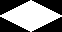
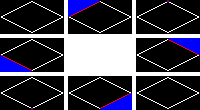
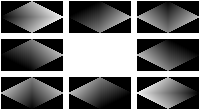

# Wangscape algorithms

This file contains detailed information about the algorithms and dataflow used in Wangscape.
Understanding them may help you to configure Wangscape to make the tilesets you want.

## Table of contents

1. [Tiles and tilesets](#tiles-and-tilesets)
1. [Rearranging source tiles](#rearranging-source-tiles)
1. [Terrain hyperraph](#terrain-hypergraph)
1. [Combining terrains](#combining-terrains)
1. [Generating corner masks](#generating-corner-masks)

## Tiles and tilesets

Wangscape's input is:
* A set of image files containing your source terrain tiles.
* A set of configuration files describing the locations of the source terrain tiles and how to combine them into tilesets. The exact format is specified in the [options schema](./schemas/options_schema.json), and includes:
  * The resolution (in pixels) of tiles used.
  * The image file and offset within the image of each terrain.
  * A set of terrain cliques (see [Terrain hypergraph](#terrain-hypergraph)).
  * Filenames of noise module groups used for [generating corner masks](#generating-corner-masks).
  * Which method is used to convert noise values into corner masks ([generating corner masks](#generating-corner-masks)).
* A set of JSON files describing module groups used to [generate noise values](#generating-noise-values).

Wangscape's output is:
* A set of image files, each one containing a full corner Wang tileset for a subset of the input terrain types,
all of them with compatible borders (if configured correctly).
* A set of JSON files describing the tilesets generated, and where to find a specific tile within them.

The schemas defining the JSON formats used by Wangscape are found in the `doc/schemas` directory,
and can be viewed in human-readable format using [docson](https://wangscape.github.io/docson/) by [@lbovet](https://github.com/lbovet).

### Input schema docson links
* [Options schema](https://wangscape.github.io/docson/#https://raw.githubusercontent.com/Wangscape/Wangscape/master/doc/schemas/options_schema.json)
* [Module group schema](https://wangscape.github.io/docson/#https://raw.githubusercontent.com/Wangscape/Wangscape/master/doc/schemas/module_group_schema.json)

### Metaoutput schema docson links
* [Tiles schema](https://wangscape.github.io/docson/#https://raw.githubusercontent.com/Wangscape/Wangscape/master/doc/schemas/tiles_schema.json)
* [Tile groups schema](https://wangscape.github.io/docson/#https://raw.githubusercontent.com/Wangscape/Wangscape/master/doc/schemas/tile_groups_schema.json)
* [Tilesets schema](https://wangscape.github.io/docson/#https://raw.githubusercontent.com/Wangscape/Wangscape/master/doc/schemas/tilesets_schema.json)
* [Terrain hypergraph schema](https://wangscape.github.io/docson/#https://raw.githubusercontent.com/Wangscape/Wangscape/master/doc/schemas/terrain_hypergraph_schema.json)

## Rearranging source tiles

Wangscape takes input tiles which could be drawn in a chess board-style display without alteration.
For instance,
[void.png](./examples/example3/void.png) ()
has a faint purple circle which should be drawn at the centre of a game tile.
Wangscape's output tiles are designed to be drawn with a half-tile offset in both x and y directions,
as seen in [README.md#what-are-corner-wang-tiles](./../README.md#what-are-corner-wang-tiles).

In order to have the purple circles correctly centred in the final display,
the output tilesets must have the circles centred at the corners of the tiles ().
To do this, each input terrain tile must be cut into quarters and rearranged as follows:
```
12 -> 34
43    21
```
When the resolution is an odd number in the x or y dimension,
the pixel at `(0,0)` is translated right and down by `(floor(rx/2), floor(ry/2))`.
So, to correctly display output tiles, they should be translated left and up by the same amount.

### Rearranging non-rectangular tiles

In the future, Wangscape is intended to support non-rectangular plane tilings, including rhombic, parallelogrammic, hexagonal, and triangular. Because Wangscape produces pixel art, it's not possible to produce true rhombi or triangles. Instead the tiling shapes must be approximated by a pixel mask:


Rearrangement must still be performed, but in cases like this is not as simple as copying rectangular regions. To correctly rearrange the rhombicc tile above, it should be divided into four rhombi, rearranged as follows:


Non-rectangular tile shapes used in games vary widely, so tile masks will need to be provided by the user when this feature is complete. Wangscape will not automatically divide tile masks into regions for rearrangement, so the tile partition must also be specified by the user as a colour-coded image file. Wangscape cannot determine the tessellation offset vectors from the tile image, so they must also be user-specified. For this tile, a valid pair of vectors would be (128, 64) and (-128, 64).

Wangscape will not constrain user-specified tile masks to be close approximations of parallelograms, hexagons, or triangles. This will mean that strange, jigsaw-like tile masks are also accepted, and the rearranged tile may have a different shape and bounding box, as seen below. The rearranged tile is called the *dual* tile, and has a dual mask and partition. Some tiles, such as rectangles and the rhombus above, are *self-dual*. This one is *non-self-dual*:


Hexagonal and triangular tile masks are also non-self-dual. As seen in the image below (by [R. A. Nonenmacher](https://commons.wikimedia.org/wiki/User:Nonenmac)), the dual tiles for a hexagonal mask would be two different triangular masks, and vice versa. A true regular hexagon would have as its dual a single triangle, drawn in two different orientations, but Wangscape's permissive specification of tile shapes requires two different triangles in the general case.

[](https://en.wikipedia.org/wiki/File:Tiling_Dual_Semiregular_V3-4-6-4_Deltoidal_Trihexagonal.svg)

### Rearrangement process for four-cornered nonrectangular tiles

Despite only supporting rectangular tile generation, the tile mask rearrangement algorithm for four-cornered nonrectangular tiles is already implemented and works as follows:

1. Load the partition image.

    
    
1. Split the partition image into four binary masks. Each mask describes one of the partition regions, and the regions must be numbered clockwise.

    
    
1. Make the base tile mask by adding all four region masks.

    
    
1. Check that the base tile mask and partition is valid:
    1. The base tile must have at least one pixel. The same applies to all four regions.
    1. The base tile must be connected. It may not be split into two or more separate pieces. The same applies to all four regions.
    1. The four regions must not overlap.
1. Make a padded copy of the base tile mask (one extra pixel on each side). Make a 3x3 tessellation of the padded base mask, with each translated copy in a different mask. The padding ensures that none of the pixels in the base mask are adjacent to the edge of the image.

    
    
1. Check that the tessellation is valid:
    1. Each mask must be strictly binary.
    1. The 9 masks may not overlap at any point.
    1. Check there are no holes in the tessellation. This check also ensures that there are no holes in the base tile itself:
        1. Find the boundary of the central tile. This is the set of pixels in the mask which are adjacent to a pixel not in the mask:

    
    
        1. Add together all the other tiles in the tessellation, and check that every pixel in the boundary is adjacent to at least one of the pixels in the surrounding tiles: 

    
    
1. Find the size of the dual tile and its position relative to the base tile mask:
    1. Find the bounding box of each of the four regions:
    
        
        
    1. Translate the region bounding boxes to their positions in the dual tile. The translation vectors are found by combining the tessellation offset vectors:
    
        
        
    1. The dual tile's bounding box is the smallest bounding box containing the four regions' translated bounding boxes:
    
        
        
1. Now that the size of the dual tile is known, make four empty masks to hold the dual regions. Copy the base regions into them, translated by the region offset vectors minus the top left of the dual tile's bounding box:

    

1. Add them all up to get the dual tile mask:

    
    
1. Pad the dual tile mask, tessellate it, and validate the dual tessellation in the same way as the base tile tessellation (5., 6.).

Now any texture with the same resolution as the base tile can be correctly rearranged using the same process as in step 8. above, using the region masks to prevent the translated copies of the base region from overlapping:

    

### Finding the dual tile edges and corners

The above algorithm is sufficient to make the dual tile's mask and partition, but to fully support nonrectangular Wangscape tiles, more work is needed. In the [example](./algorithm.md#example) of noise value generation below, modules 5, 7, and 10 generate values based on a mathematical formula which is only correct in the case of rectangular tiles. To support other geometries, alternative modules must be provided which take the tile's bitmap geometry into account. The basis of these modules will be distance from corners and edges, which must be identified during the tile rearrangement process.

1. Take the padded dual mask tessellation:

    
    
1. Find the boundary of the central mask:

    
    
1. For each of the 8 surrounding tiles in the tessellation, restrict the central boundary to the pixels adjacent to that tile:

    
    
1. The dual tile's edge masks are the boundary masks which correspond to tiles orthogonally adjacent to the central mask:

    
    
1. The dual tile's corner masks consist of pixels which satisfy either of these conditions:
    1. The pixel is in a boundary mask which corresponds to a tile diagonally adjacent to the central mask.
    1. The pixel is in the edge preceding this corner, and adjacent to a pixel in the edge following this corner.
    1. The pixel is in the edge following this corner, and adjacent to a pixel in the edge preceding this corner.

    
    
1. The dual tile edge and corner masks are still padded from the tessellation, so crop one pixel from each side to get the final edge and corner masks:

    

1. Treat the dual tile mask as a lattice graph (with or without diagonal connections), and use breadth-first search to find each pixel's distance from the corners and edges:

    

## Terrain hypergraph

### Adjacency restrictions

In a display map built strictly from square tiles, there are no restrictions on which terrain types can border each other.
In a display map built from corner Wang tiles, there are restrictions on which terrain types can meet at a single corner.
For instance, you could generate tilesets where desert and tundra can never be adjacent.
However, some restrictions can be more subtle than that.
For instance, you could generate tilesets with this situation :
```
G: grass
C: sea
P: plains
D: desert

GC    GC    GP    CP    GC
PP    DD    DD    DD    PD
Legal Legal Legal Legal Illegal
```
In theory, the algorithms described below allow you to generate any individual corner Wang tile you want,
with as many different versions as you want.
However, manually listing each individual tile and the number of spares would be impractical
when configuring Wangscape to generate a set of tiles usable for map displays.

It is also possible to simply generate one tile for every combination of terrain types in the game.
If you have a lot of terrain types, this will produce a large number of tiles (`N^4`), which has many disadvantages:
* In a single tileset, the size of the tileset may exceed the maximum texture size of low-end or legacy graphics cards.
* In individual files, the number of tiles may affect performance when browsing the output files.
* The large number of tiles will take a long time to generate, slowing down the configuration process.
* A large number of generated tiles may never be used, for instance all tiles containing deep water and land.

A sensible compromise between texture size and folder size,
and between simple and complex configuration,
is to define a [hypergraph](https://en.wikipedia.org/wiki/Hypergraph) on the set of terrains.

### Hypergraph

The terrain hypergraph, for the purposes of Wangscape, is a list of lists of terrains.
For each list of terrains (which we call cliques), one tileset is generated,
with a single tile for each combination of four terrains in the clique.

Subject to the restriction that each clique must be unique (ignoring order of terrains),
the terrain hypergraph can configure the legal terrain combinations as follows:
* If a set of 2, 3 or 4 terrains is not found in any of the cliques,
those terrains cannot appear around a common corner.
In the case of two terrains, this means they cannot be adjacent (even diagonally).
* If a set of terrains appears in more than one (different) clique,
extra tiles will be generated for each combination of those tiles.
The extra tiles will have different borders (except for the single-terrain tiles),
and can be used to add variety to output displays.

Make sure your hypergraph is connected, where appropriate.
If your hypergraph is (for instance) `[["a","b"],["c","d"]]`,
then it will be impossible for terrains `a` and `b` to be on the same map as terrains `c` and `d`.

If you have a set of `N` terrains in which all combinations must be allowed,
you have a few different options:
* Put them all in one clique. This will generate the smallest number of tiles,
but the largest texture size.
* Choose a clique size `4 <= C < N`, and make one clique for each combination of `C` terrains.
That's `N!/(C!(N-C)!)` cliques, each with texture size `(rx*C^2, ry*C^2)`.
Your choice of `C` will depend on your requirements for texture size, folder size, and computation time.
If `N` is so large that no `C` satisfies your requirements,
you will need to introduce more adjacency constraints.

## Combining terrains

Each tile has corner terrains `t1, ..., t4`, and is generated as follows:

1. Generate a [corner mask](#generating-corner-masks) for each corner.
They are essentially 8-bit greyscale images with the same resolution as a tile,
and should satisfy these constraints:
    
    1. The total of the corner masks in each pixel is 255.
    1. Each one has value 255 at the corresponding corner (hence each one has value 0 at all other corners).
    1. Along the horizontal border (transitioning from `t1` to `t2` or from `t3` to `t4`) incident on the corresponding corner,
    each one has values similar to those generated for all other corner masks with a similar horizontal border.
    1. Equivalent constraints for vertical borders.
1. Initialise the output tile to opaque black `(0,0,0,255)`.
1. For each corner mask and corresponding ([rearranged](#rearranging-source-tiles)) terrain texture:
    
    1. Add the terrain texture, multiplied by the corner mask and scaled, to the output tile.

Note that this is not the standard alpha blending algorithm.
However, it is easy to configure OpenGL's blending equation and parameters to perform this operation.

## Generating corner masks

Corner masks (effectively 8-bit greyscale images) are generated in two stages:

1. A raster of floating-point noise values is calculated for each corner. They should satisfy these constraints:
    
    1. Each one has value 1 or greater at the corresponding corner.
    1. Each one has value 0 at all other corners.
    1. Along the horizontal border (transitioning from `t1` to `t2` or from `t3` to `t4`) incident on the corresponding corner,
each one has values similar to those generated for all other corner masks with a similar horizontal border.
    1. Equivalent constraints for vertical borders.
1. For each pixel, an alpha calculator converts the four floating-point values at that pixel into four 8-bit unsigned integer values,
such that the above constraints on corner mask values are satisfied.

### Generating noise values

Noise values are generated using libnoise modules, and a few libnoise-compatible modules defined by Wangscape.
All modules, and their connections to source modules, are fully customisable by the user.
This is done using a module group format similar to that specified by [RESTnoise](restnoise.readme.io/).
The exact format of Wangscape module groups is specified in the [module group schema](./schemas/module_group_schema.json).
The output noise module is evaluated at regularly spaced points in the square `[0,1]x[0,1]`.

The generation of noise values is quite delicate, mostly because of the border constraints.
In order to satisfy them while maintaining fully customisability,
four module groups are combined in order to generate noise values for a corner mask:
1. A horizontal border module group.
1. A vertical border module group.
1. A central module group.
1. A combiner module group.

The central and border module groups take no input, and should output values between -1 and 1.

The combiner module group uses weighting functions to construct a module with values derived from the other three. It should satisfy the following constraints:
* Along the horizontal border incident on the associated corner, it fades from 1 to -1, with exact values modulated by the horizontal border module.
* Along the vertical border incident on the associated corner, it fades from 1 to -1, with exact values modulated by the vertical border module.
* Along the other two borders, it has value 0.
* In the centre, it has values primarily influenced by the central module group.

To ensure variety in output tiles, all seedable modules in the central module group are reseeded before each use.

To ensure border compatibility, all seedable modules in the border module groups are reseeded only once, at the start of execution.
Also, when the corner is at the top of the tile, the horizontal border module group is translated upwards by 1. A similar conditional translation is applied to the vertical border module group.

To ensure that border module group output values are used meaningfully,
user-specified horizontal module groups are replaced with a constant value of 0 when the corner is on the right.
User-specified vertical module groups are similarly replaced when the corner is on the bottom.

The corner combiner group uses 3 major components to combine the central and border module groups:

1. A `CornerCombiner` module, which has value 1 along one of the axes, value -1 along the other axis, and value 0 along diagonals.
This is used as the control module to blend the horizontal and vertical border module groups into one texture with border compatibility.
1. A `NormLPQ` module, which has value 0 at the associated corner and value at least 1 at the other three corners.
This is used as input to two `Curve` modules,
which together form an envelope with range [1,1] at the associated corner and [-1,-1] at the other corners.
Near the associated corner the range of the envelope is a subrange of [-1,1].
This envelope is used to transform the combined border modules into a texture
which will reliably produce correct alpha values at the corners,
and fade noisily along the two incident borders.
1. Another `NormLPQ` module, which is scaled and clamped to have value -1 at the centre of the tile and value 1 near to all the borders.
This is used as the control module to blend the central module group with the combined and faded border modules, without allowing reseeded central module groups to affect border compatibility.

#### Debugging

Wangscape module configurations can be complex,
and it's difficult to create or fine-tune a configuration based on just
mathematical theory and the appearance of the output tilesets.
To help with this, Wangscape provides the option to output debug tilesets.
Just set the `DebugOutput` field to `true` in the main configuration file.
This will output tilesets for each module named in the module groups,
allowing you to debug them individually and localise the source of errors present in the end result.

Be aware that making debug tilesets require a lot more graphical memory than normal execution.
If the memory requirement exceeds your graphical memory,
a workaround is to use a software implementation of OpenGL such as Mesa.
This will possibly be slower, but will only be limited by your computer's main memory.
A Windows DLL for Mesa can be downloaded [here](http://download.qt.io/development_releases/prebuilt/llvmpipe/windows/opengl32sw-32.7z);
use [7-Zip](http://www.7-zip.org/) to extract the file into the same directory as `Wangscape.exe` and rename it to `opengl32.dll`.

#### Example

This example will illustrate with diagrams how noise values are calculated for a bottom left corner. Blue pixels represent positive values, red values represent negative values, and black represents 0.

1. Central module group:

    
  
1. Horizontal module group:

    
  
1. Horizontal module group (2), translated by `(0,-1,0)` because the corner is on the bottom. Note how the bottom border of this image matches the top border of the untranslated horizontal module group:

    
    
1. Vertical module group (replaced by `Const` 0 because the corner is on the bottom):

    
    
1. Corner combiner module (translated and clamped):

    
    
1. Blend of vertical border module (4) and translated horizontal border module (3), controlled by corner combiner. Note how the left border resembles the vertical border module, and the bottom border resembles the translated horizontal border module. Closer to the diagonal the values are a more even blend:

    
    
1. Distance (using the [L1 metric](https://en.wikipedia.org/wiki/Taxicab_geometry)) between the pixel and the corner. White pixels represent values greater than 1:

    
    
1. Pair of modules derived from the corner distance (7), creating an envelope used to fade the blended border modules (6):

    
    

1. Blend of the lower and upper bounds of the envelope (8), controlled by the blended border modules (6):

    

1. Distance (using the [L(1.5) metric](https://en.wikipedia.org/wiki/Lp_space#The_p-norm_in_finite_dimensions)) between the pixel and the tile centre, scaled and clamped to `[-1,1]`:

    

1. Blend of the central module group (1) and the enveloped border modules (9), controlled by the distance from the centre (10).

    

1. Module 11, scaled and clamped to `[0,1]`:

    


### Alpha calculation

Wangscape has a few different methods available to convert noise values into corner mask (alpha) values.

* `Max` assigns all 255 points to the terrain with the highest noise value. Example:


* `Linear` tries to split the 255 points between all four terrains in a ratio as close as possible to the noise values.
For this to work, all the noise values should be positive.
Using this alpha calculator is very prone to error, reflected in black pixels in the output tiles.
Noise values can be very similar in the centre, so it is a good idea to raise them to a power (5 or more) before applying linear alpha calculation. Example:


* `TopTwo` splits the 255 points between the two terrains with the highest noise values.
The third highest noise value is used as a baseline, and the ratio is raised to a user-specified power before application,
so the resulting formula is `(v1-v3)^p : (v2-v3)^p`.
The resulting visual effect can closely resemble `Linear`, `Max`, or `Max` with antialiasing, depending on the value of `p`. Example:


* `Dither` uses the same ratio calculation as `TopTwo`, but uses it to randomly select one of the top two terrains. The winner gets all 255 points. Example:


